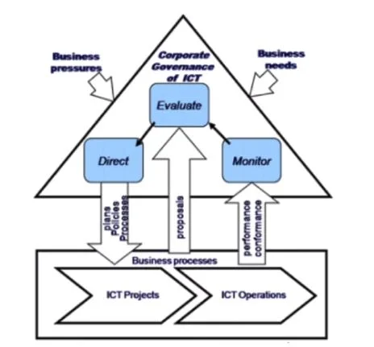

  ## História do Cobit & Certificações

## O que é a ISO? 

A ISO - sigla para *International Organization for Standardization* - é uma entidade de padronização e normatização que foi criada em Genebra, na Suíça, em 1947. Ela estabelece padrões para indústrias e seguimentos inteiros, além de normatizar uma série de práticas e técnicas que tem impacto nas empresas. O Brasil possui uma associação chamada ***Associação Brasileira de Normas Técnicas*** que serve para fazer uma "ponte" entre o Brasil, as empresas nacionais, suas normas e a ISO.  Existem normas como a ISO 20000, direcionadas para infraestrutura de TI e gestão de serviços de TI. Então, a ISO corresponde a entidade global que padroniza certas formas de trabalho e que determina as formas que empresas de segmentos específicos devem seguir. 

O COBIT é inspirado em uma norma. Essa norma é a ISO/IEC 38500 que estabelece um modelo de Governança Corporativa de TI. Esse padrão traz um melhor entendimento do que é Governança.

Governança para TI, de acordo com a ISO/IEC 38500 é:

> "O sistema pelo qual o uso atual e futuro da TI é dirigido e controlado. A Governança corporativa de TI envolve a avaliação e a direção do uso da TI para dar suporte à organização no alcance de seus objetivos estratégicos e monitorar seu uso para realizar os planos. A Governança inclui a estratégia e as políticas para o uso de TI dentro de uma organização."

Agora, sabemos que Governança corporativa envolve avaliação e direção de TI para ajudar a organização a alcançar objetivos estratégicos. Então, TI é como um parceiro estratégico para os negócios, mas ao mesmo tempo é a unidade do negócio, funciona como uma unidade que precisa ser alinhada ao todo.

 

 

Repare no gráfico da imagem acima, ele é retirado da norma 38500. Note que há um triângulo, essa forma nos ajuda a entender a Governança corporativa. Vamos considerar de um lado do triângulo as pressões do negócio e de outro as necessidades. Como principal ponto da governança temos a ***avaliação***.  Mas, o que é avaliação? São os ***objetivos*** e  com base na avaliação dos objetivos é que vamos dirigir a organização. Buscaremos os processos do COBIT para que nos auxiliem a avaliar e dirigir. E isto nos leva para projetos e operações de TI. 

Portanto, vamos gerir o que acontece com projetos e operações. Observe que a gestão da TI está em um segundo nível no gráfico e no primeiro está a Governança, ou seja, a Governança é a gestão da gestão. Gerir projetos e operações é gerir a TI, mas organizar tudo e depois monitorar para avaliar se os projetos atenderam ou não os objetivos e se estão seguindo o caminho que deveriam para reentrar no ciclo é papel da Governança que é responsável por monitorar e avaliar.

Nesse gráfico, no segundo nível, encontramos as posições do gerente de projetos e do gerente operacional. Acima destes está o gerente de TI e mais acima o *C.I.O.* (chief information officer). Junto com o *C.I.O.* existem outros profissionais, outros líderes executivos como o *C.E.O.* (chefe executivo) e o *C.O.O.* (chief operational officer), etc. Então, no primeiro nível temos a Governança e no segundo a gestão.

## O que é Governança?

Para explicar o que é Governança vamos usar o exemplo de um barco, portanto, governança é como "dirigir" um barco. São os diretores e executivos que dirigem, enquanto quem cuida das velas e quem rema é o time da gerência. 

Agora, tente desenhar esse gráfico em um papel, tendo em mente fatores externos como, as pressões do negócio, as necessidades do negócio, os objetivos da organização, a avaliação, a direção (a gestão da TI) e o monitoramento. Tudo isso em um ciclo contínuo da Governança da organização. 