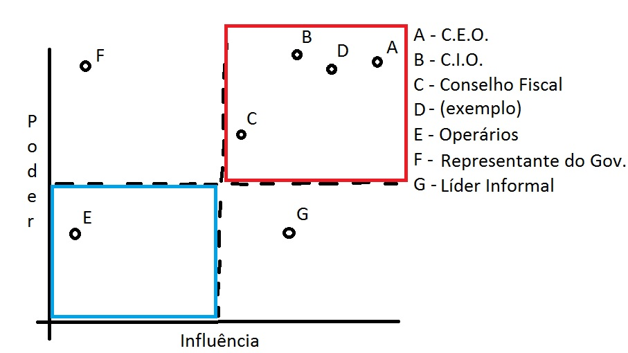
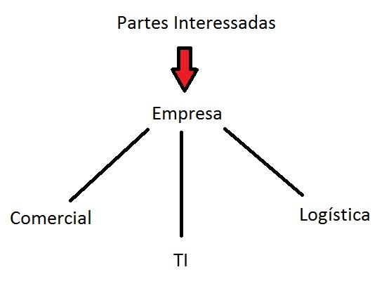

  # Influência versus interesse

## Matriz de Influência versus Interesse

 

 

Na matriz acima temos dois eixos, o poder e a influência, com isso podemos identificar as Partes Interessadas existentes. Dividimos a matriz em quatro áreas e a partir dessa divisão podemos determinar estratégias de como abordar cada Parte Interessada. As partes com mais poder e influência são:

 -  O *C.E.O.* (*Chief Executive Officer*)
 -  O *C.I.O.* (*Chief Information Officer*)

Estes são profissionais que estamos considerando como Partes Interessadas, mas também podemos considerar grupos como:

 - O Conselho Fiscal, que detêm muito poder e influência em uma organização.

Todas as Partes Interessadas muito poderosas e influentes dentro da organização estão na divisão de cima a direita. Precisamos manter essas partes informadas e satisfeitas. A partir da divisão superior, conseguimos chegar a uma estratégia de gestão das Partes Interessadas. 

Agora, vamos pensar em outro grupo, os de baixo poder e baixa influência.

- Operários;

É uma triste realidade, mas em muitos casos os operários são colocados na matriz para serem observados apenas para quando for preciso tomar ações corretivas quanto a seu comportamento. 

Podemos pensar também em outra Parte Interessada com pouca influência dentro da organização, mas que possui muito poder, por exemplo:

 - Representante do Governo;

Podemos, ainda, ter como último item uma Parte Interessada com muita influência, mas pouco poder:

 - Líder Informal;

 

## Fluxo de Objetivos

Após catalogar e listar as Partes Interessadas devemos negociar decisões levando em conta o interesse de todos esses grupos. Então convidamos você a conhecer o **Fluxo de Objetivos**.

 

  

 

As Partes Interessadas podem ter diversos objetivos, pois podem existir muitas Partes Interessadas. Além disso, a Empresa também tem seus próprios objetivos, como aumentar a lucratividade. Além da Empresa precisamos pensar também nos objetivos de cada área, como a TI, o departamento comercial, a logística, etc e também nas suas respectivas metas e atividades. Dessa forma, os objetivos serão cascateados, ou seja, os objetivos de uma Parte Interessada devem estar alinhados aos objetivo da Empresa para se tornarem o objetivo de uma área ou departamento específico.

 

## [Exercício] Partes Interessadas

Fizemos muitos desenhos nas últimas duas aulas para entendermos melhor as partes interessadas. Satisfazer as necessidades das Partes Interessadas está melhor associada a qual alternativa?

- [ ] A) Defender decisões considerando os interesses de todos os grupos.
- [ ] B) Negociar decisões considerando os interesses do investidor.
- [x] C) Negociar decisões considerando os interesses de todos os grupos.
  > Como vimos em aula, este princípio do COBIT 5 orienta que as decisões devam ser negociadas considerando sempre o interesse de todos os grupos envolvidos.