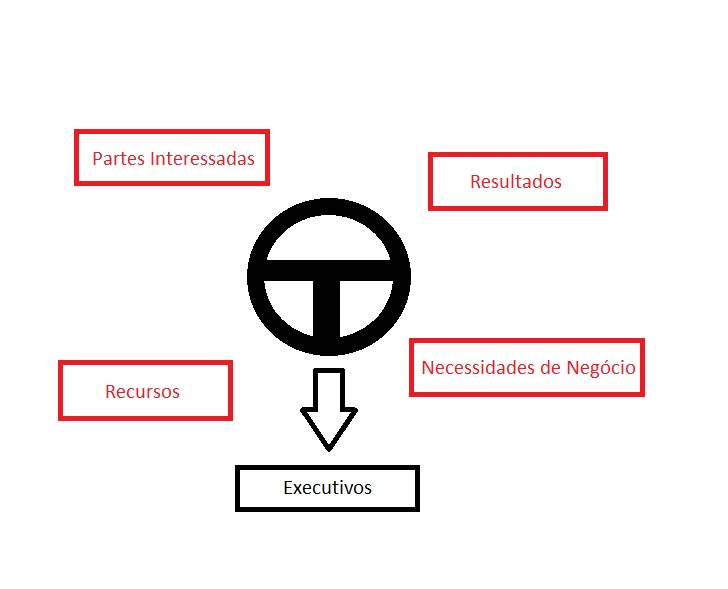

  # Objetivos

 

## Decisões Cobit

Convidamos você a estudar conosco o funcionamento da **Tomada de Decisões no COBIT** e como a Governança Corporativa participa neste processo frente aos objetivos das Partes Interessadas.

 

  

 

Os itens em vermelho indicam tudo que compõe e influencia a tomada de decisão: as Partes Interessadas e seus objetivos, a busca por resultados, os recursos e as necessidades do negócio. Onde está a Governança Corporativa quando o assunto é relacionar todos esses componentes? Está no centro de tudo! Ela está representada pelo volante e esse símbolo não é por acaso, a Governança Corporativa é o conjunto de princípios e facilitadores encadeados que vão funcionar como um sistema de controle e navegação. Atrás do volante estão os executivos controlando tudo. Um conceito da Governança Corporativa é o de **steering wheel** (volante), ou seja, o grupo de direcionamento.