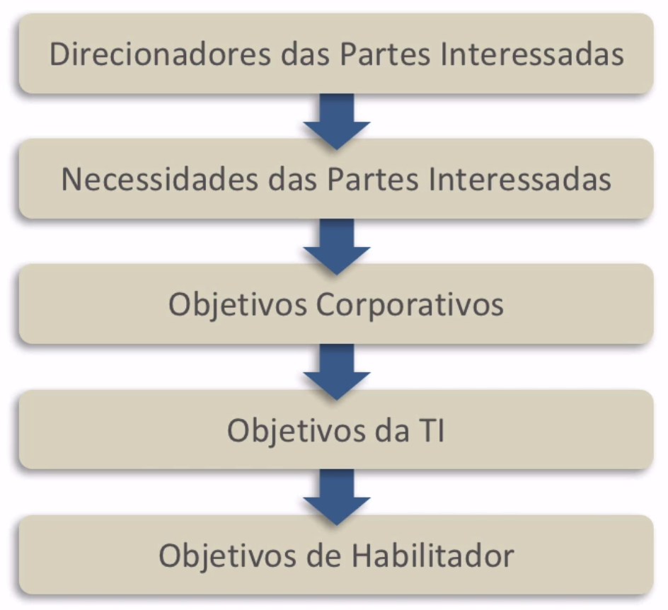

  # Objetivos

 

## Decisões Cobit

Convidamos você a estudar conosco o funcionamento da **Tomada de Decisões no COBIT** e como a Governança Corporativa participa neste processo frente aos objetivos das Partes Interessadas.

 

  

 

Os itens em vermelho indicam tudo que compõe e influencia a tomada de decisão: as Partes Interessadas e seus objetivos, a busca por resultados, os recursos e as necessidades do negócio. Onde está a Governança Corporativa quando o assunto é relacionar todos esses componentes? Está no centro de tudo! Ela está representada pelo volante e esse símbolo não é por acaso, a Governança Corporativa é o conjunto de princípios e facilitadores encadeados que vão funcionar como um sistema de controle e navegação. Atrás do volante estão os executivos controlando tudo. Um conceito da Governança Corporativa é o de **steering wheel** (volante), ou seja, o grupo de direcionamento.

 

## Cascata de objetivos

A **cascata de objetivos** é o que coloca o COBIT em andamento, em qualquer organização. Ao estudar essa ferramenta entendemos o caminho feito pelos objetivos, desde seu surgimento até o momento em que são alcançados. Ao entender o modo de operação da cascata de objetivos podemos compreender também a Administração por Objetivos (APO), abordada nas aulas anteriores. Logo abaixo está uma imagem de referência para auxiliar nas explicações que veremos no restante desta aula. Nela estão contidos os objetivos centrais e sua visualização permite entender visualmente a ideia de "cascata":

 

  

 

- Tudo começa com o **direcionamento** dos grupos e das pessoas que compõem os *stakeholders* - as partes interessadas - em relação ao negócio. 

- Logo, nós vamos ter, além do direcionamento geral das partes interessadas, as **necessidades**. Na indústria da moda, empresas específicas e grandes conglomerados produzem e vendem roupas no mercado de forma rápida. Neste exemplo, as partes interessadas são muitas, por exemplo, os investidores, os acionistas e os operários. No caso, os acionistas estão atrás de mais dinheiro, mais retorno, enquanto os operários das fábricas buscam melhores condições de vida. Este é um exemplo de necessidade das partes interessadas.

- Os direcionadores e as necessidades das partes interessadas ajudam a chegar nos **Objetivos Corporativos**, que podem ser mais vendas, mais ganhos, etc.

Vamos interpretar as três primeiras etapas deste esquema como um funil, muitos interesses entram no funil por meio de um processo específico e particular de cada organização, que é o entendimento do que é importante para o negócio. Esses interesses se convertem em Objetivos Corporativos, que são convertidos em **Objetivos de TI** e que, por último, tornam-se os **Objetivos de Habilitador**.

- **Objetivo da TI**: um dos objetivos pode ser aumentar a satisfação dos clientes e usuários por meio de uma boa prestação de serviços. Este é o ponto de contato no qual qualquer pessoa que deseja pode contatar a empresa, seja para pedir a segunda via de um documento, seja para um chamado técnico de instalação de um produto. O atendimento recebido pelo cliente em uma central de serviço é o que determina a satisfação do mesmo. Para aumentar a satisfação do cliente existem **processos**.

- **Objetivos de Habilitador**: São os processos que permitem que cumpramos as metas da organização. Por exemplo, aumentar a capacidade de uma empresa de gerir incidentes. O *gerir incidentes* é um processo, é o habilitador, e está diretamente relacionado aos objetivos da corporação. No processo de produção e atendimento da empresa, por exemplo, se a meta da central de serviço é que o cliente sinta-se mais satisfeito, um habilitador seria resolver os problemas apresentados na primeira e única chamada. A etapa da **Cascata de Objetivos** está mais próxima da produção.

A partir daqui, nós conseguimos fazer uma aproximação do dia a dia de trabalho com o COBIT, pois começamos a entender melhor como o papel na organização está relacionado aos objetivos corporativos.

 

## [Exercício] Cascata de Necessidades

Devemos fixar as ideias apresentadas nas aulas sobre Partes Interessadas. Qual a sequência correta da cascata de necessidades estudada no princípio "Satisfazer as necessidades das Partes Interessadas"?

- [ ] A) Objetivos Corporativos, Necessidades das Partes Interessadas, Objetivos da TI, Objetivos de Habilitador e Direcionadores das Partes Interessadas.
- [x] B) Direcionadores das Partes Interessadas, Necessidades das Partes Interessadas, Objetivos Corporativos, Objetivos da TI e Objetivos de Habilitador.
  > A sequência correta da cascata de necessidades iniciasse por Direcionadores das Partes Interessadas. Seguida por Necessidades das Partes Interessadas, Objetivos Corporativos, Objetivos da TI e Objetivos de Habilitador.
- [ ] C) Necessidades das Partes Interessadas, Objetivos da TI, Objetivos Corporativos, Objetivos de Habilitador e Direcionadores das Partes Interessadas.
- [ ] D) Objetivos de Habilitador, Direcionadores das Partes Interessadas, Objetivos Corporativos, Necessidades das Partes Interessadas e Objetivos da TI.